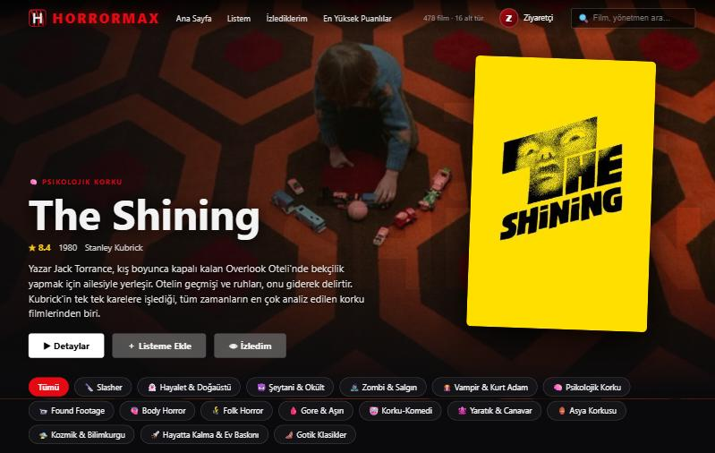
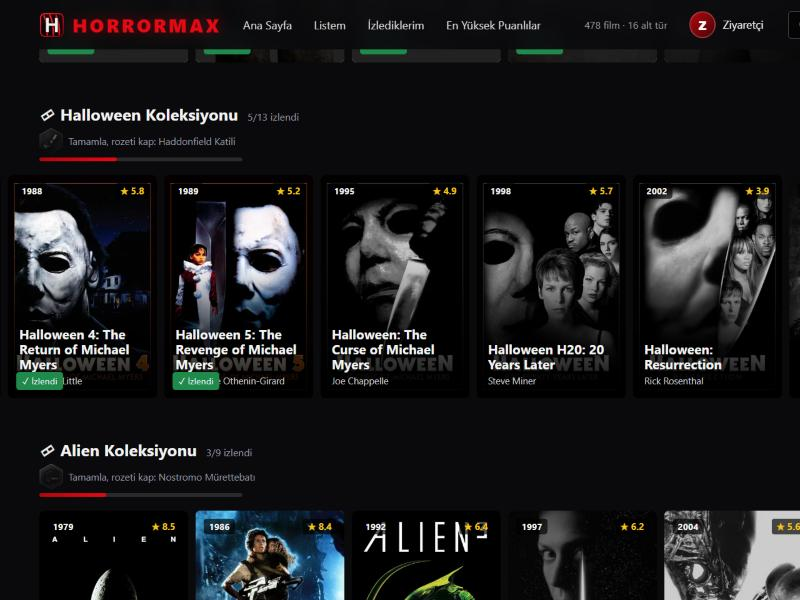
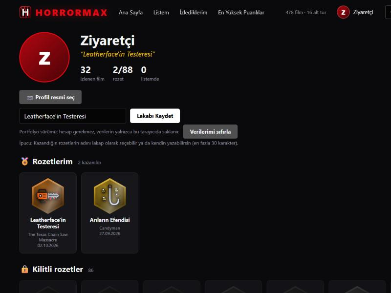
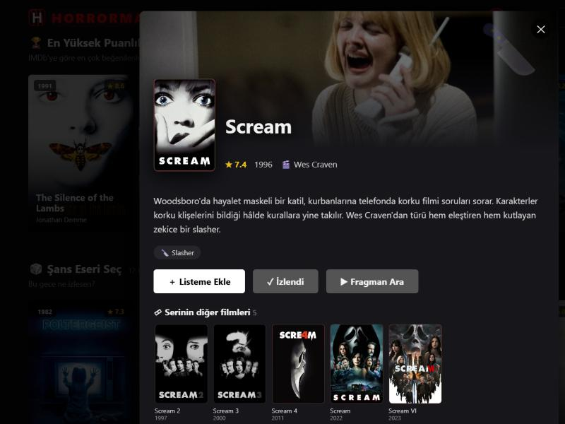
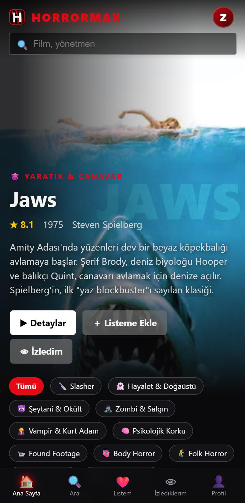

<p align="center">
  
</p>

<h3 align="center">Sadece korku filmlerinden oluşan, Netflix tarzı bir film kütüphanesi</h3>

<p align="center">
  <a href="https://fahriefe.github.io/horrormax/"><b>▶ Canlı demo</b></a>
  &nbsp;·&nbsp;
  <a href="https://github.com/fahriefe/horrormax_app">Uygulama sürümü</a>
</p>

<p align="center">
  
  
  
  
  
</p>

<p align="center">
  
</p>

---

## 🎬 Proje hakkında

**HORRORMAX**, 478 korku filmini 16 alt türe ayıran, Netflix benzeri bir film kütüphanesidir. Ana sayfada filmin afişi ve sahnesiyle öne çıkan büyük bir alan, her alt tür için yatay kaydırmalı satırlar, arama ve film detayları bulunur.

Bir **oyunlaştırma katmanı** da var: izlediğin filmleri işaretlersin, bir serinin tüm filmlerini bitirince o seriye özel çizilmiş bir **rozet** kazanırsın, rozetlerini profilinde sergilersin.

> Bu depo, projenin **web sitesi / portfolyo** sürümüdür: sunucu ya da hesap gerektirmez, herkes gezebilir. Kullanıcı hesaplı, telefona kurulabilen **uygulama sürümü** [ayrı bir depoda](https://github.com/fahriefe/horrormax_app) tutulur ve **şahsi kullanım** içindir.

## ✨ Öne çıkanlar

- 🎞 **478 film, 16 alt tür:** Slasher, Hayalet, Şeytani, Zombi, Vampir, Psikolojik, Found Footage, Body Horror, Folk Horror, Gore, Korku-Komedi, Yaratık, Asya, Kozmik, Hayatta Kalma, Gotik
- 📚 **88 film serisi koleksiyonu:** Halloween, Elm Street, Scream, Saw gibi serilerin tüm filmleri ve devam filmleri bir arada
- 🏅 **88 özel çizim rozet:** her seri için elle tasarlanmış SVG rozetler (ör. Texas Chain Saw için Leatherface'in kanlı testeresi)
- 👁 **İzlediklerim:** izlediğin filmler renkli, izlemediklerin gri; izlenenler öneri listelerinden çıkar
- 👤 **Profil:** profil resmi, lakap, rozet vitrini
- 🔎 Arama, alt tür filtreleri, "serinin diğer filmleri" ve "benzer filmler"
- 📱 **Mobil uyumlu:** telefonda alt sekme çubuğu, parmakla kaydırma, dokunmatik dostu kartlar
- 🎨 Akıcı animasyonlar: kart çıkışları, rozet kazanma ekranı, sayfa konumunu bozmayan yeniden çizim

<p align="center">
  
  
</p>
<p align="center">
  
  
</p>

## 🛠 Teknik notlar

- **Çatısız (vanilla) tek sayfa uygulama:** HTML, CSS ve JavaScript; derleme adımı ya da bağımlılık yok. Statik barındırmada (GitHub Pages) çalışır.
- **Veri modeli:** filmler alt türlere göre gruplanmış bir dizide; seriler (koleksiyonlar) film adı kalıplarıyla otomatik oluşturulur.
- **Rozetler:** her koleksiyon için SVG çizimler, küçük yardımcı fonksiyonlarla (`P`, `C`, `E`, `R`, `L` gibi) kodla üretilir; altıgen çerçeve ve parlama animasyonu CSS ile yapılır.
- **Kalıcılık:** izlediklerin, listen, rozetlerin, lakabın ve profil resmin ziyaretçinin tarayıcısında (`localStorage`) saklanır; sunucuya kişisel veri gitmez. Profil resmi tarayıcıda kırpılıp küçültülür.
- **Akıcı arayüz:** FLIP tekniğiyle kart kaybolma animasyonları, kaydırma konumunu koruyan "yumuşak yeniden çizim", sabit sıralı rastgele öneriler.
- **Mobil:** `viewport-fit`, güvenli alan (safe-area) boşlukları, dokunmatik cihazlarda her zaman görünen düğmeler.
- **Görseller:** afişler ve sahneler [TMDB](https://www.themoviedb.org/) üzerinden gösterilir, depoda saklanmaz.

## 🚀 Yerelde çalıştırma

Kurulum gerekmez. Depoyu indir ve herhangi bir statik sunucuyla aç:

```bash
python -m http.server 8000
# sonra http://localhost:8000 adresini aç
```

## 📂 Yapı

```
index.html     uygulamanın tamamı (arayüz + mantık)
veri/          filmler, Türkçe açıklamalar, rozet verileri ve çizimleri
icons/         logo ve favicon
screenshots/   ekran görüntüleri
```

## 🖼 Atıf ve not

Film bilgileri ve Türkçe açıklamalar bu proje için hazırlanmıştır; IMDb puanları yaklaşık değerlerdir. Bu proje kâr amacı gütmez, bir portfolyo çalışmasıdır.

<sub>Bu ürün TMDB API'sini kullanır ancak TMDB tarafından onaylanmamış veya sertifikalandırılmamıştır.</sub>
